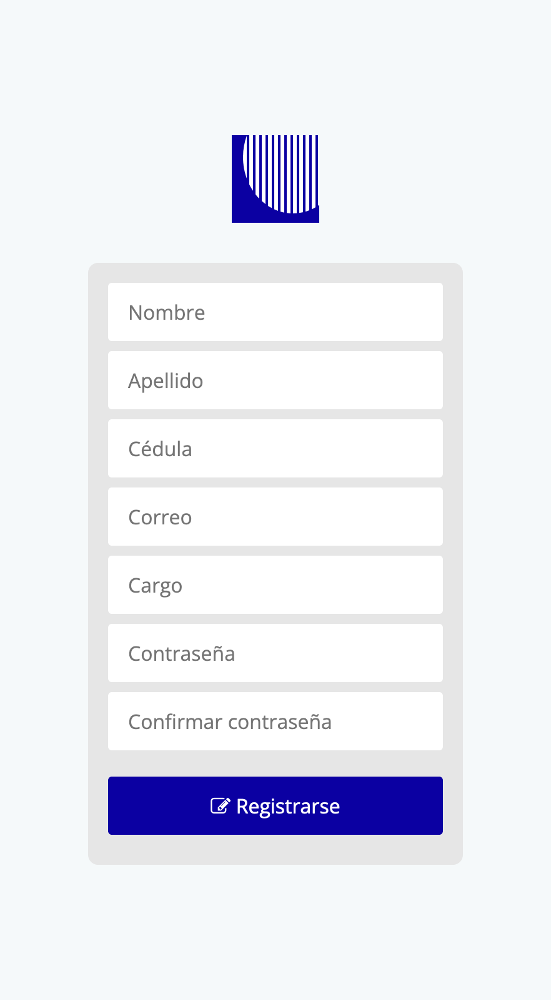

# arpApp

Es una aplicación web para automizar procesos de auditoria.

# Link

https://jalkntoth.github.io/arpApp/

## Descripción

La app aún esta en construcción y hasta ahora encuentras el diseño web estático, y parte del registro de usuario en php. 

## Capturas de Pantalla





## Estructura del PHP

```
app/
├── public/             
│   └── style.css
├── views/              
│   ├── login.php       
│   ├── register.php    
│   ├── dashboard.php   
│   └── error.php       
├── src/               
│   └── Auth.php            
├── .gitignore           
├── .git                 
├── .env               
├── README.md            
├── composer.json       
├── composer.lock       
└── index.php           
```

## Instalación

1. Clona el repositorio:

```bash
git https://github.com/jalknToth/arpApp.git
```

2. Instala las dependencias:

```bash
composer install
```

## Ejecución

1. Inicia la aplicación:

```bash
php -S localhost:2006
```

2. Abre tu navegador web y visita `http://localhost:2006`

## Contribuciones

Las contribuciones son bienvenidas. Por favor, abre un *issue* o envía un *pull request*.
