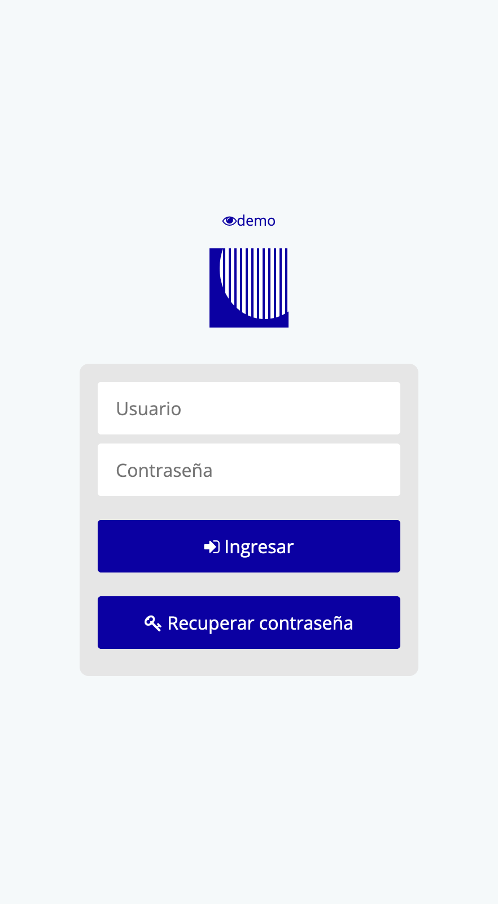
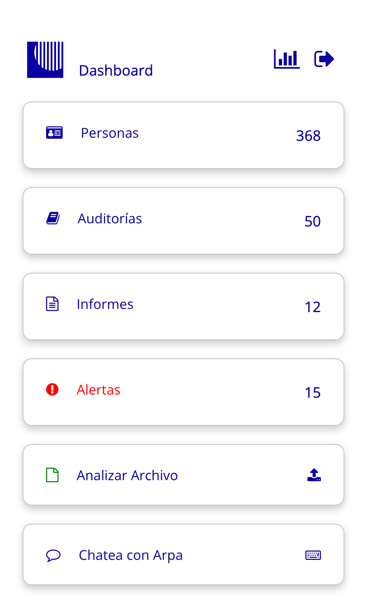
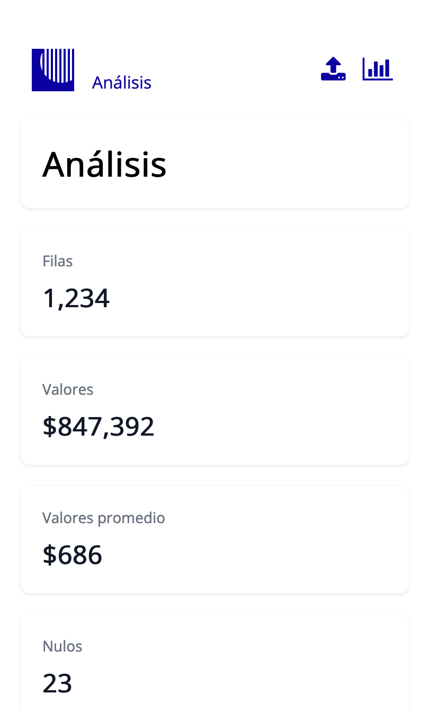

# arpApp

Es un App para Automizar Procesos de Auditoria (RPA).

# Link

https://jalkntoth.github.io/arpApp/

## Introduccion y contextualización

La auditoría es un proceso crucial para asegurar el buen manejo de recursos de una empresa. Tradicionalmente, estas auditorías involucran tareas repetitivas y manuales que consumen mucho tiempo y recursos.  Este proyecto de RPA (Automatización Robótica de Procesos) busca automatizar esas tareas, optimizando el proceso de auditoría y liberando a los auditores para que se centren en análisis más estratégicos.  Este RPA se enfoca en el análisis de archivos en Excel, y se ha desarrollado para identificar fraudes o irregularidades en el manejo del dinero.

## Revisión Teórica y Empírica 

La automatización de procesos robóticos (RPA) está revolucionando la forma en que las empresas realizan sus operaciones.  Estudios recientes demuestran que la RPA puede aumentar la eficiencia y reducir los errores en tareas repetitivas.  En el contexto de la auditoría, la RPA permite automatizar tareas como Analizar datos de Excel, realizar operaciones, sacar porcentajes, extraer y transformar informacion.  Esta automatización se basa en Python utilizando diversas librerías como Pandas y Matplotlib, en la que se puede extraer, transformar, cargar datos, para luego permitir que el auditor interactue con los resultados en la App.

## Análisis y Exploración 

Este proyecto analiza las necesidades de una auditoría y explora las posibilidades de automatización.  Se identificaron las siguientes áreas clave para la automatización: extraer, transformar y cargar.  Se realizó un análisis comparativo entre los métodos manuales y automatizados para determinar el potencial de mejora en términos de tiempo, precisión y costo.  La automatización reduce el tiempo de auditoría en un gran porcentaje y minimiza los errores humanos.

## Enfoque Metodológico

Este RPA utiliza un enfoque basado en datos, para automatizar las tareas de auditoría. El proceso automatizado incluye los siguientes pasos:

1. Extraer datos relevantes.
2. Analizar los datos.
3. Generar un informe.

# Beneficios

Los beneficios clave de utilizar este RPA son:

* **Mayor eficiencia:** Reduce significativamente el tiempo requerido para realizar auditorías.
* **Mayor precisión:** Elimina los errores humanos y proporciona resultados consistentes.
* **Reducción de costos:** Libera a los auditores para que se centren en tareas de mayor valor.
* **Mayor cobertura:** Permite auditar un mayor número de páginas y elementos web.
* **Informes automatizados:** Genera informes detallados y fáciles de interpretar.
* **Escalabilidad:** Se puede adaptar fácilmente para auditar diferentes tipos de sitios web.

## Capturas de Pantalla







## Estructura Python
```
app/
├── static/             
│   ├── style.css
│   └── styleIN.css
├── templates/          
│   ├── login.html      
│   ├── register.html   
│   ├── dashboard.html  
│   └── error.html      
├── database/          
│   └── db.py          
├── .env               
├── .gitignore        
└── app.py            
```
## Estructura PHP

```
app/
├── public/             
│   └── style.css
├── views/              
│   ├── login.php       
│   ├── register.php    
│   ├── dashboard.php   
│   └── error.php       
├── src/               
│   └── Auth.php            
├── .gitignore           
├── .git                 
├── .env               
├── README.md            
├── composer.json       
├── composer.lock       
└── index.php           
```

## Instalación

1. 

```bash
git https://github.com/jalknToth/arpApp.git
```

2. Instala las dependencias:

```bash

```

## Ejecución

1. Inicia la aplicación:

```bash

```

2. Abre tu navegador web y visita

## Contribuciones

Las contribuciones son bienvenidas. Por favor, abre un *issue* o envía un *pull request*.
